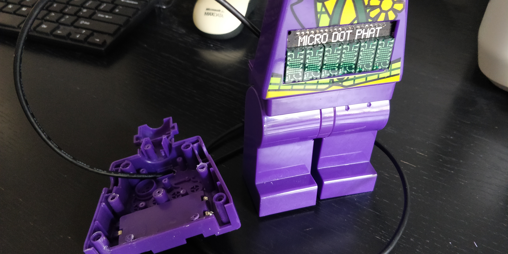

# The-Joker-Clock

A simple Lego Joker Clock, that tells the time and also randomly shouts out Joker quotes at you!

The Joker Clock is a not any standard clock.  Yes it tells the time making use of the Pimoroni Micro Dot pHAT LED Matrix Display which displays the time and various animations in a lovely neon green glow.  However, at random moments in time the Joker shouts out classic 'Joker style' quotes to scare anyone who may be around or trying to tell the time.  Then the clock display returns and it is, just a clock again.

# What you need
* Lego Joker Clock
* Pi Zero W
* Pimoroni micro Dot pHAT
* Bluetooth Speaker
* Right angled micro USB
* Basic tools, screwdriver etc.

[Project Website](https://www.tecoed.co.uk/the-joker.html)

[YouTube Video](https://www.youtube.com/watch?v=FiOva5_eKcw)